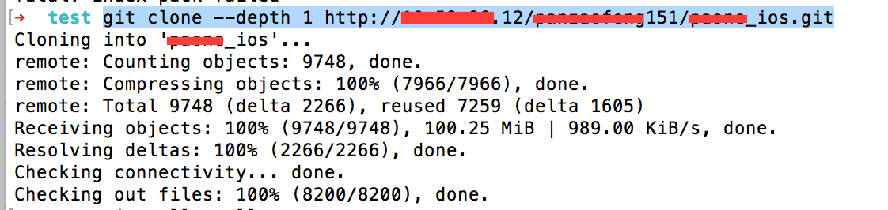

# git clone失败解决方案

近期因为项目工程文件过大，导致很多同事git clone失败出现以下错误。

	Cloning into '******_ios'...
	remote: Counting objects: 270053, done.
	remote: Compressing objects: 100% (97903/97903), done.
	fatal: The remote end hung up unexpectedly022.73 MiB | 827.00 KiB/s    
	fatal: early EOF
	fatal: index-pack failed

**引起这种错误的原因可能是因为 git server 内存小无法承载大文件的 clone。**

>经过各种 google baidu 找到以下解决办法：

`打开终端`
### 第一步
	cd <目标文件夹>
	git clone --depth 1 <Repo URI>
	cd <项目目录>
	git fetch --unshallow
	or
	git fetch --depth=2147483647

这个时候你会发现项目被克隆下来了，但是分支很少。
### 第二步
	cd .git
	vi config
修改 config 文件

将 
	
	fetch = +refs/heads/master:refs/remotes/origin/master
改成

	fetch = +refs/heads/*:refs/remotes/origin/*
保存退出

### 第三步
	cd <项目目录>
	git pull --all
OK，成功获取到了项目的全部分支

### 第四步
使用 SourceTree 添加已存在的本地仓库，同步分支文件。	

## end
	
	
## 以下是我的操作

	

	
	